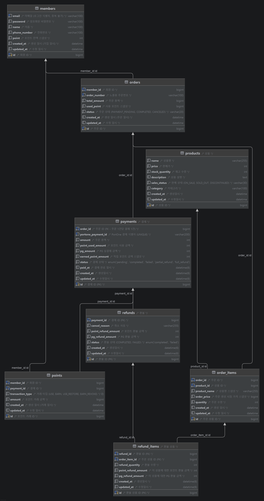

# commerce-payment


## 🛠 주요 기술 스택


## 📁 디렉토리 구조
```text
    ├── 📁 domain         // 핵심 비즈니스 로직을 도메인(기능) 단위로 분리한 패키지
    │   ├── 📁 auth       // 인증/인가 도메인
    │   ├── 📁 cart       // 장바구니 도메인
    │   ├── 📁 member     // 회원 도메인
    │   ├── 📁 order      // 주문 도메인
    │   ├── 📁 payment    // 결제 도메인 (아래는 payment 도메인의 내부 구조 예시)
    │   │   ├── 📁 controller  // HTTP 요청을 받고 응답을 반환하는 프레젠테이션 계층
    │   │   ├── 📁 dto         // 계층 간 데이터 교환을 위한 객체 (Request, Response DTO 등)
    │   │   ├── 📁 entity      // 데이터베이스 테이블과 매핑되는 JPA 엔티티 객체
    │   │   ├── 📁 error       // 도메인 커스텀 에러
    │   │   ├── 📁 port        // 외부 시스템 또는 인프라와의 통신을 위한 인터페이스(포트) 모음
    │   │   ├── 📁 repository  // 데이터베이스에 접근하여 엔티티를 저장/조회하는 영속성 계층
    │   │   └── 📁 service     // 핵심 비즈니스 로직을 수행하는 서비스 계층
    │   ├── 📁 refund       // 환불
    │   ├── 📁 product      // 상품
    │   └── 📁 point        // 포인트
    │
    ├── 📁 global         // 프로젝트 전역에서 공통으로 사용되는 인프라성/설정 코드 패키지
    │   ├── 📁 config     // Spring Security, WebMvc, Swagger 등 각종 설정 파일
    │   ├── 📁 entity     // 공통 엔티티 속성 (예: 생성일, 수정일을 담은 BaseEntity)
    │   ├── 📁 error      // 전역 예외 처리(Global Exception Handler) 및 커스텀 예외 정의
    │   ├── 📁 filter     // 서블릿 필터 (예: CORS 필터, 로깅 필터 등)
    │   ├── 📁 jwt        // JWT 토큰 생성 및 검증을 위한 유틸리티 및 프로바이더
    │   └── 📁 response   // API 공통 응답 포맷 (CommonResponse, ApiResponse 등)
    │
    ├── 📁 infra          // 외부 시스템 연동 및 인프라 구현체 패키지
    │   └── 📁 portone    // 외부 결제 PG사(PortOne) 연동 관련 구현 코드
    │
    └── 📁 web            // 프론트엔드 뷰(View) 렌더링용 컨트롤러 패키지
```

## 📝 API 명세서


## 📊 ERD (Entity Relationship Diagram)



## 📌 개발 규칙 및 코드 컨벤션

### 네이밍 규칙 (Naming Conventions)
* 클래스명: PascalCase (예: AdminService)
* 메서드 및 변수명: camelCase (예: getAdmins, adminId)
* 상수명: UPPER_SNAKE_CASE (예: MAX_PAGE_SIZE)
* [DB 테이블 및 컬럼](https://app.notion.com/p/teamsparta/3ba2dc3ef51480c8b635d36ff3f58c64): snake_case (예: admin_role, created_at)

### 🏗 아키텍처 및 DTO


### 🌐 RESTful API 설계
* URI 표기: 소문자와 하이픈(-) 위주로 사용하며, 자원(Resource)은 복수형 명사로 표현합니다. (예: /admins/{adminId})
* HTTP 메서드: 의미에 맞는 표준 메서드(GET, POST, PUT, PATCH, DELETE)를 엄격히 사용합니다.


### 🐙 Github 규칙 (Github Rules)
[Github 규칙 보러가기](https://app.notion.com/p/teamsparta/Github-Rules-f122dc3ef51483a9a9f281afd1836033)
* ✨ feat : 새로운 기능 추가
* 🐛 fix : 버그 수정
* 📄 docs : 문서 수정
* ♻️ style : 코드 포멧팅, 세미콜론 누락, 코드 변경이 없는 경우
* 🩹 refactor : 코드 리펙토링
* 🚚 test : 테스트 코드, 리펙토링 테스트 코드 추가
* 🔥 chore : 빌드 업무 수정, 패키지 매니저 수정